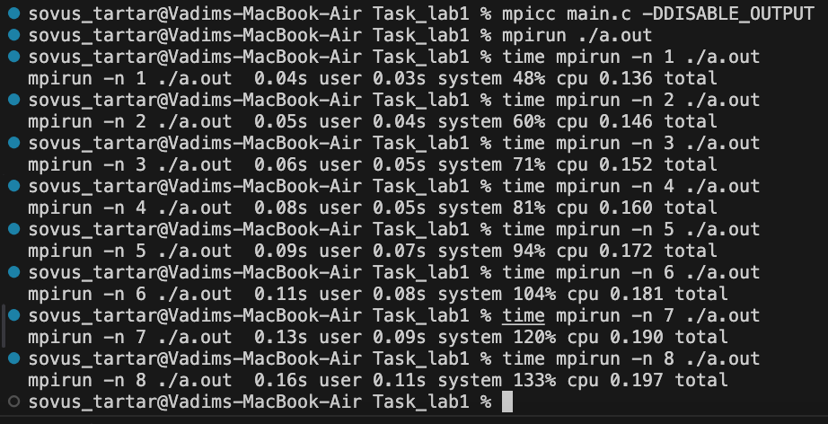
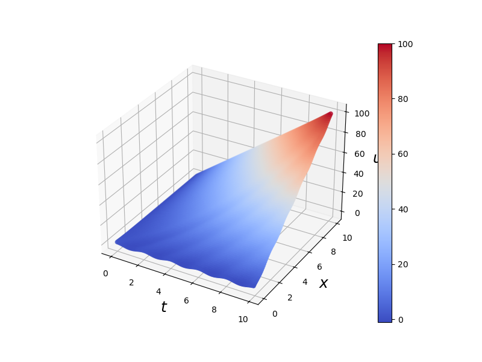

# Результаты выполнения работы

### Ускорение

По данным, приведенным в скриншоте в папке видно, что в моём случае имеет место быть замедление при введении многопоточности. Это может быть связано с особенностями моего железа или особенностями реализации MPI под мою архитектуру(arm64)

.

### График

.

### Выходные данные

Данные представлены в файле 1.out